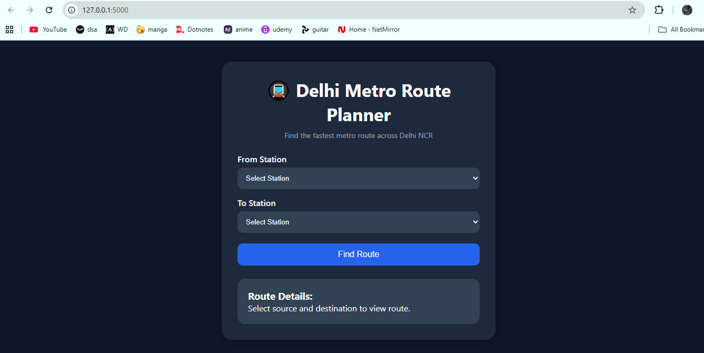
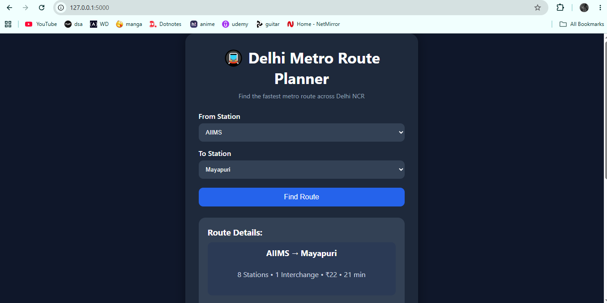
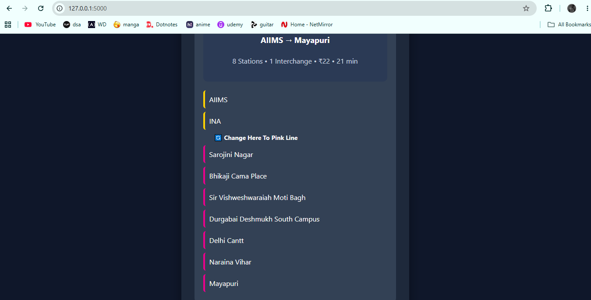

# Delhi Metro Route Planner 🚇

A web-based Delhi Metro Route Planner built using Python and Flask.

## Features

- Find route between two metro stations
- Show number of stations
- Calculate estimated travel time
- Calculate estimated fare
- Detect interchanges
- Display metro line colors
- Route summary for easy viewing

## Technologies Used

- Python
- Flask
- HTML
- CSS
- JSON
- Graph Data Structure
- BFS (Breadth First Search)

## Project Structure

```text
METRO_PROJECT/
│
├── app.py
├── metro_data.py
├── lines.json
├── README.md
│
├── templates/
│   └── index.html
│
├── static/
│   └── css/
│       └── style.css
```
## How to Run

1. Install Flask

```bash
pip install flask
```

2. Run:

```bash
python app.py
```

3. Open:

```text
http://127.0.0.1:5000
```

## Future Improvements

- Support for branch metro lines
- More Delhi Metro lines
- Better fare calculation
- Improved route optimization

## Screenshots

### Home Page



### Route Summary



### Route with Interchange



## Author

Jaswinder Singh  
B.Tech CSE
